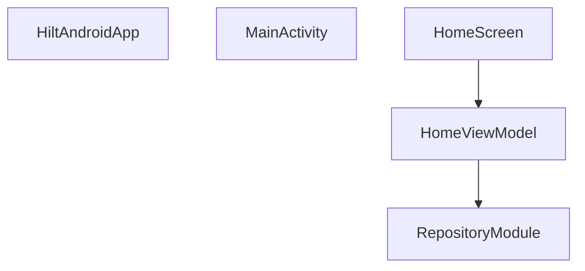

```mermaid
graph TD;
    MyApplication[HiltAndroidApp];
    MainActivity;
    HomeScreen-->HomeViewModel;
    HomeViewModel-->RepositoryModule;
    
    click MyApplication callback "Tooltip for a callback"
```
