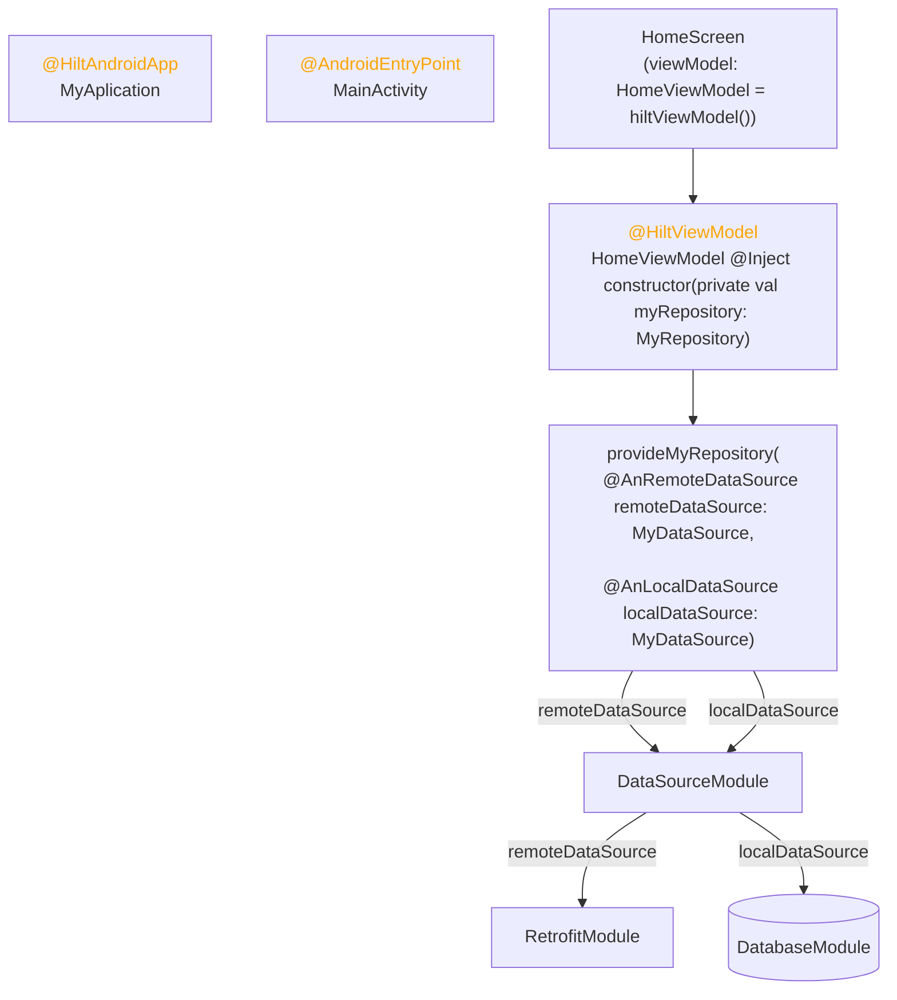

```mermaid


graph TD;
    MyApplication["<font color='#fca503'>@HiltAndroidApp</font><br>MyAplication"];
    MainActivity["<font color='#fca503'>@AndroidEntryPoint</font><br>MainActivity"];
    HomeScreen["HomeScreen<br>(viewModel: HomeViewModel = hiltViewModel())"]-->HomeViewModel;
    HomeViewModel["<font color='#fca503'>@HiltViewModel</font><br>HomeViewModel @Inject constructor(private val myRepository: MyRepository)"]-->RepositoryModule;
    RepositoryModule["provideMyRepository(
    @AnRemoteDataSource remoteDataSource: MyDataSource,
    <br>@AnLocalDataSource localDataSource: MyDataSource)"]--remoteDataSource-->DataSourceModule;
    RepositoryModule--localDataSource-->DataSourceModule;
    DataSourceModule--remoteDataSource-->RetrofitModule;
    DataSourceModule--localDataSource-->DatabaseModule[(DatabaseModule)];

```
