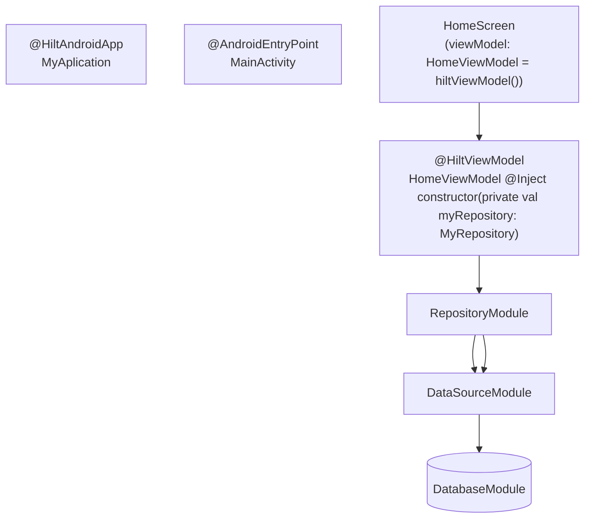

```mermaid


graph TD;
    MyApplication["@HiltAndroidApp<br>MyAplication"];
    MainActivity["@AndroidEntryPoint<br>MainActivity"];
    HomeScreen["HomeScreen<br>(viewModel: HomeViewModel = hiltViewModel())"]-->HomeViewModel;
    HomeViewModel["@HiltViewModel<br>HomeViewModel @Inject constructor(private val myRepository: MyRepository)"]-->RepositoryModule;
    RepositoryModule-->DataSourceModule;
    RepositoryModule-->DataSourceModule;
    DataSourceModule-->DatabaseModule[(DatabaseModule)];

```
