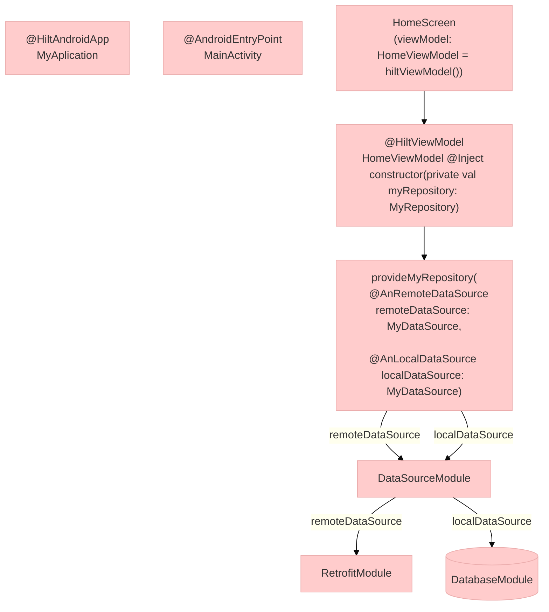

```mermaid


%%{init: {'theme': 'base', 'themeVariables': { 'primaryColor': '#ffcccc', 'edgeLabelBackground':'#ffffee', 'tertiaryColor': '#fff0f0'}}}%%
graph TD;
    MyApplication["@HiltAndroidApp<br>MyAplication"];
    MainActivity["@AndroidEntryPoint<br>MainActivity"];
    HomeScreen["HomeScreen<br>(viewModel: HomeViewModel = hiltViewModel())"]-->HomeViewModel;
    HomeViewModel["@HiltViewModel<br>HomeViewModel @Inject constructor(private val myRepository: MyRepository)"]-->RepositoryModule;
    RepositoryModule["provideMyRepository(
    @AnRemoteDataSource remoteDataSource: MyDataSource,
    <br>@AnLocalDataSource localDataSource: MyDataSource)"]--remoteDataSource-->DataSourceModule;
    RepositoryModule--localDataSource-->DataSourceModule;
    DataSourceModule--remoteDataSource-->RetrofitModule;
    DataSourceModule--localDataSource-->DatabaseModule[(DatabaseModule)];

```
